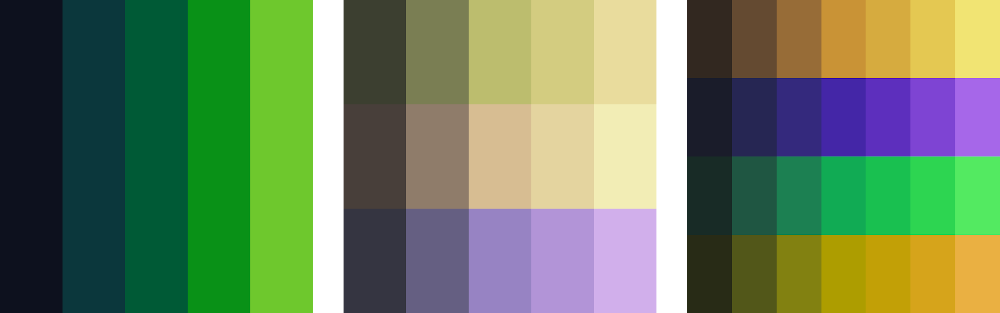
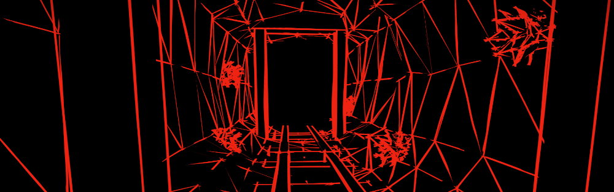
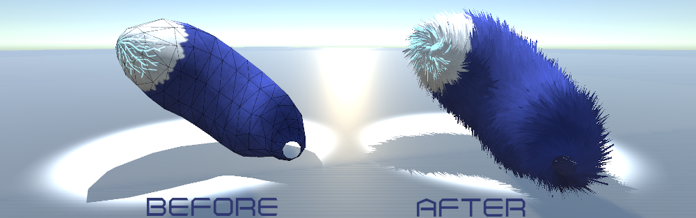
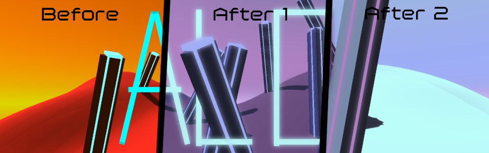

Pile of Shaders <!-- omit in toc -->
======

Exactly what it says on the tin. Just a collection of hopefully at least somewhat interesting shaders I've written/will write in various different projects. They're not production ready at all and usually also pretty inefficient.

These will (probably) all come from Unity projects across various versions I'm not even keeping track of. Things may work, or may not work in your version. I'm also going for "works on my machine"-approach, not using the proper tools like [`UNITY_REVERSED_Z` and friends](https://docs.unity3d.com/Manual/SL-PlatformDifferences.html). These shaders are very much not production ready.

Also, they're in just one giant unorganised pile. Mainly because some things will probably be dependencies of multiple other things, without me knowing about it just yet.

Note that almost everything here is [unlicense](./UNLICENSE)-licensed. Go ham. Except if that ham lives in the realm of production ready software, as I might not have mentioned yet they are not of that quality. The files not unlicensed have their source mentioned at the top of their files, and are also listed here for convenience:

* [`Distributions.cginc`](./Distributions.cginc) has been modified from <https://www.chilliant.com/rgb2hsv.html>
* [`xoshiroplus.cginc`](./xoshiroplus.cginc) has been modified from <https://vigna.di.unimi.it/xorshift/> via [CC0](http://creativecommons.org/publicdomain/zero/1.0/).

Table of Contents <!-- omit in toc -->
======
1. [Palette Generator](#palette-generator)
2. [Sketch Outline](#sketch-outline)
3. [Fluff](#fluff)
4. [ColorMap](#colormap)

Palette Generator
=================

Main shader files: [`Palette.shader`](./Palette.shader) + [`PaletteContent.cginc`](./PaletteContent.cginc), [`PaletteGenerator.cginc`](./PaletteGenerator.cginc)  
Dependencies: [`ColorSpaces.cginc`](./ColorSpaces.cginc), [`Distributions.cginc`](./Distributions.cginc), [`xoshiroplus.cginc`](./xoshiroplus.cginc)  
Preview: [Youtube](https://youtu.be/3f-_7IJsX74) (No audio)

A shader that can generate monochromatic, complementary, analogous, etc. palettes. Also has the option to get discrete brighter/darker shades (which have a bit of hue-shifting to make it look nicer). They are displayed in a simple grid, but the `palette` struct defined in `PaletteGenerator.cginc` contains everything needed to do more than just displaying a simple grid.

Sketch Outline
==============

Main shader files: [`SketchOutline.shader`](./SketchOutline.shader) + [`SketchOutlineContent.cginc`](./SketchOutlineContent.cginc) (Pass 1) + [`SketchOutlineContent2.cginc`](./SketchOutlineContent2.cginc) (Pass 2)  
Dependencies: [`xoshiroplus.cginc`](./xoshiroplus.cginc), `UnityCG.cginc`  
Preview: All red/black portions (usually in just the peripherals) in [this video](https://youtu.be/8FtlRY6haUI) (Audio warning!)

A shader that renders geometry by wireframes that look messily sketched out. (Compare this to most wireframe shaders that just draw straight thin lines.) This shader is *very* expensive, drawing up to seven triangles per triangle. Six of those are generated in a geometry shader, and geometry shaders aren't known for their speed. This shader is a fun one for working non-trivially with all coordinate spaces you can encounter while writing shaders.

One of the things the shader needs to have passed is the textures of the sketched outlines. The texture I used can be found at [SketchOutlineLines.png](./SketchOutlineLines.png). Import that without discarding any transparent pixel's information because all four channels are equally important.

Fluff
=====

Main shader files: [`FluffyShader.shader`](./FluffyShader.shader) + [`FluffyContent.cginc`](./FluffyContent.cginc) (Forward, Additive Passes), [`FluffyShadowContent.cginc`](./FluffyShadowContent.cginc) (Shadow Pass), [`FluffyHull.cginc`](./FluffyHull.cginc) (Hull + Domain helpers)  
Dependencies: [`Distributions.cginc`](./Distributions.cginc) (+[`xoshiroplus.cginc`](./xoshiroplus.cginc)), `AutoLight.cginc`, `UnityCG.cginc`, `UnityStandardCoreForward.cginc`, `UnityStandardShadow.cginc`

A shader that turns simple geometry into fluffy geometry, by just adding a bunch of vertices and extruding them randomly. (I know, more sophisticated methods exist.) For instance, you can make somewhat cheap somewhat convincing tails with this. Introducing geometry via hull shaders saves sending tons of data to the GPU, and as opposed to geometry shaders, isn't a sin.

The workhorse of this shader is [`FluffyHull.cginc`](./FluffyHull.cginc), which contains the function that calculates where new vertices should go. It's kinda wonky. My attempt at calculating tangents if they're not given isn't smooth and sometimes just flips around completely. Normal singularities also aren't too pretty, but I don't feel like fixing that. Go blame the hairy ball theorem if your mesh is homeomorphic to a sphere. Otherwise, most other meshes won't have singularities at obvious locations.

The rest of the files are just boilerplate to delegate all physical shading to the Standard shader. In this case I *could* have written a surface shader (as Unity gave those explicit tessellation support), but I wanted to do things manually. This way I can refer back to this when Unity *doesn't* provide support for whatever weird shenanigans I get up to.

ColorMap
=========

Main shader files: [`ConvertColor.shader`](./ConvertColor.shader)  
Dependencies: [`ImageEffect.cginc`](./ImageEffect.cginc)  
Main c# files: [`ColorConverterBehaviour.cs`](./ColorConverterBehaviour.cs), [`ColorMap.cs`](./ColorMap.cs)  
Dependencies: [`ExtensionMethods.cs`](./ExtensionMethods.cs)  
Editor: [`ColorMapPropertyDrawer.cs`](./ColorMapPropertyDrawer.cs)

A small pipeline that is basically "palettes are a thing!", but not pixel art. With properly authored content, you can easily switch between various palettes. The "proper" part consists of ensuring your content:
- Has two main colour axes `r` and `g` in use, where you're free to define what they mean. (Instead of their traditional `red` and `green` meanings.) Personally, I use `r` for "brightness" and `g` for "uniqueness".
- Uses `b` to denote how much bloom should be applied to those pixels. (Hey, if you have a colour channel left, why not use it for something useful.)

The star of the show is `ColorConvertBehaviour.cs` that calls various shaders in `ConvertColor.shader`. This behaviour is very much showcase-y and not all that useful by itself otherwise with half of its content being wrapped in a `#IF UNITY_EDITOR` and all. This behaviour depends mainly on a `ColorMap`: a class where you define that certain points should be a certain colour, where all other points are some interpolation of those. You can also smoothly transition between different ColorMaps. Stuff's not *that* optimised, but on my pretty average laptop recomputing the colour map for no reason and applying the bloom every frame takes up a very insignificant amount time.

With the editor-folder property drawer the inspector for editing the colour maps is a bit more convenient, having a preview and all.

No, I don't have a better preview test scene for the thumbnail than this, that would actually take time. Yes, I literally dreamt this stuff up and implemented it after I woke up, a few days back.